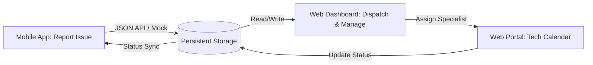
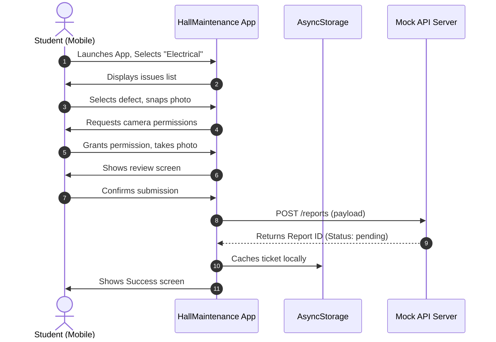
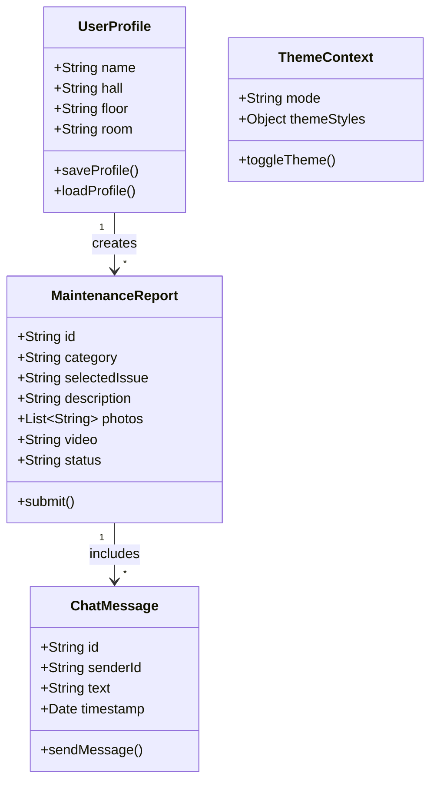

# KNUST Hall Maintenance System - Mobile Student Client
## Technical Project Documentation
*Structured according to the KNUST College of Engineering Project Documentation Guidelines*

---

## Document Metadata
- **Project Title:** KNUST Hall Maintenance System (Mobile Student Client)
- **Target Platform:** Mobile Operating Systems (Android, iOS)
- **Development Stack:** React Native, Expo SDK (v54), React Navigation, AsyncStorage Caching
- **Integration Partner:** Admin-Dashboard Web Portal (React 19)
- **Author:** System Development Team

---

# Table of Contents
1. [Chapter 1: Introduction](#chapter-1-introduction)
2. [Chapter 2: Review of Related Works / Similar Systems](#chapter-2-review-of-related-works--review-of-similar-systems)
3. [Chapter 3: Methodology](#chapter-3-methodology)
4. [Chapter 4: Implementation and Results](#chapter-4-implementation-and-results)
5. [Chapter 5: Findings and Conclusion](#chapter-5-findings-and-conclusion)
6. [References](#references)

---

# Chapter 1: Introduction

### Problem Statement
From a student's perspective at Kwame Nkrumah University of Science and Technology (KNUST), reporting a room defect (such as a broken door handle, blown socket, or leaking shower head) is a slow and frustrating process. The existing system requires students to visit the hall porter's lodge during working hours to write down details in a paper book. This introduces major hurdles:
- **High Friction:** Students often postpone reporting minor defects because of the physical effort and time required to walk to the lodge.
- **Ambiguous Descriptions:** Technical details of faults are often missing or poorly described, making it difficult for technicians to bring the correct replacement parts.
- **Lack of Tracking:** Once reported, students have no way to know if their request was received, assigned to a technician, or scheduled for repair.
- **Lack of Direct Communication:** Students cannot talk directly to assigned technicians to coordinate meeting times or clarify issues, leading to missed appointments.

### Aim of the Project
The primary aim is to design and develop a user-friendly mobile application (**HallMaintenance**) built with React Native and Expo, which allows residential students to submit maintenance reports with photo and video attachments, track the repair status in real-time, view facility rules, and chat directly with assigned maintenance specialists.

### Specific Objectives of the Project
1. **Defect Categorization Flow:** Implement an intuitive, step-by-step reporting wizard dividing issues into key categories (Electrical, Plumbing, Carpentry, Masonry) with common pre-defined issues and text options.
2. **Camera & Video Integration:** Use native device APIs to allow students to take photos or record videos of faults to provide clear visual evidence.
3. **AsyncStorage Local Caching:** Maintain a local cache of user profile details (Name, Hall, Floor, Room) and submitted tickets to ensure fast page loads.
4. **Direct Chat System:** Construct a screen for students to chat directly with technicians to discuss details and schedule repairs.
5. **Support and Resources:** Provide informational portals including FAQs, official facility guidelines, and emergency telephone lines.

### Justification of Project
Building a mobile application makes reporting much easier for students. By allowing photo and video attachments, students can document the issue clearly, helping technicians diagnose and prepare for repairs before they arrive. Real-time status updates and direct messaging resolve scheduling conflicts, improving overall student satisfaction and saving operational time.

### Motivation for Undertaking Project
The motivation comes from a desire to address real campus challenges using modern cross-platform mobile frameworks. Using React Native and Expo showcases how mobile tech can bridge the gap between student residents and campus service staff.

### Scope of Project
The mobile application represents the user-facing reporting client. Its scope includes:
- User onboarding and room registration.
- Step-by-step maintenance reporting wizard.
- Access to the device camera and photo library.
- Direct messaging chats with technicians.
- Local profile editing and dark/light mode toggle.
- Offline read support for FAQs and facility regulations.

### Project Limitations
- **Mock Service APIs:** Network transactions connect to a simulated local mock-server (`PORT 3001`) and fall back to local AsyncStorage when offline.
- **Operating System Dependencies:** Real push notification triggers require active developer keys and configuration with Apple APNs and Google FCM services.

### Beneficiaries of the Project
- **On-Campus Students:** Can report defects and check progress from their rooms.
- **Campus Technicians:** Can receive clear visual context and talk directly to students.
- **Hall Porters and Staff:** Save administrative time spent logging and routing reports.

### Academic and Practical Relevance of the Project
- **Academic:** Demonstrates cross-platform compilation, device permissions (Camera/Library), state management, and tab/stack navigation routing in mobile environments.
- **Practical:** Provides a working mobile application tailored for KNUST student housing, ready to be paired with administrative backends.

### Project Activity Planning and Schedules
The project followed an Agile Scrum process across a 4-sprint timeline:

| Sprint | Phase | Key Tasks | Deliverables |
|--------|-------|-----------|--------------|
| **Sprint 1** | Requirements & UX | Design screen mockups, map navigation flow, configure Expo setup. | UX Wireframes, Navigation Maps |
| **Sprint 2** | UI Framework | Implement custom theme context, build navigation tabs, lay out screens. | Theme Context, App Skeleton |
| **Sprint 3** | Media & Reporting | Implement Expo ImagePicker, build report forms and media upload screen. | Report Wizard, Camera Integration |
| **Sprint 4** | Chat & Caching | Implement AsyncStorage services, write chat client modules, connect mock API. | Local DB Caching, Chat Screens |

### Structure of Report
- **Chapter 1:** Outlines project context, goals, scope, and plan.
- **Chapter 2:** Reviews manual systems, analyzes existing products, and introduces the proposed system architecture.
- **Chapter 3:** Discusses Scrum methodology, functional requirements, UML diagrams, security, and logical design.
- **Chapter 4:** Details implementation details, algorithms, code listings, and verification tests.
- **Chapter 5:** Covers findings, challenges, lessons learned, and recommendations.

### Project Deliverables
1. React Native source code compiled under Expo SDK v54.
2. Local utilities for AsyncStorage sync (`reports.ts`, `appointments.ts`).
3. Core layout, page modules, CSS design tokens.
4. Comprehensive project documentation file (`PROJECT_DOCUMENTATION.md`).

---

# Chapter 2: Review of Related Works / Review of Similar Systems

### Processes of the Existing System
Students must physically report to the porter's lodge, locate the paper logbook, write down details (Room, Name, Defect, Date), and wait for staff to process it. This leads to slow dispatch times and high rates of missing reports.

### Review of Similar Systems
1. **Generic Web Portal Forms:**
   - *Pros:* Simple to develop; accessible from any web browser.
   - *Cons:* Lacks native mobile features (such as launching the camera to take photos instantly), has no push notifications, and has poor offline support.
2. **Commercial Tenant Portals (e.g. Rent Cafe, Resident Center):**
   - *Pros:* Complete accounting integrations, rent payments, lease signing, and work order submissions.
   - *Cons:* Overly complex, expensive licenses, and not optimized for university-specific setups (such as KNUST hall/block assignments).

### The Proposed System
The proposed system integrates a student-facing React Native mobile client with a React-based administrative web portal. 



### Conceptual Design
The mobile app handles issue creation:
1. **Input:** The student registers their room details (e.g. `Unity Hall, Floor 2, Room 204`).
2. **Filing:** When a defect occurs, the student opens the app, selects a category, checks standard issues, writes extra details, takes a photo/video, and submits.
3. **Status Sync:** The request status is monitored on the app (`Pending` -> `Scheduled` -> `In Progress` -> `Resolved`).
4. **Chatting:** If details are needed, the student uses the app to chat directly with the technician.

### Architecture of the Proposed System
- **Expo Framework Runtime:** Runs on both Android and iOS without rewriting the UI code.
- **Navigation Engine:** Uses `@react-navigation/stack` for modal overlays and `@react-navigation/bottom-tabs` for the main dashboard views.
- **Local Storage Engine:** Uses `@react-native-async-storage/async-storage` to keep local profiles and cache tickets.
- **Device API Bridge:** Uses `expo-image-picker` to access the camera and library, and `expo-video` to play video attachments.

### Component Designs and Descriptions
- **TabNavigator Component:** Manages the persistent bottom navigation tabs (Home, Requests, Notifications, Help).
- **ServiceIssuesScreen:** Displays a customized list of issues based on the selected category (Electrical, Plumbing, Carpentry, Masonry).
- **PhotosUploadScreen:** Handles camera integration, displays progress bars for uploads, and enforces file limits.
- **ChatScreen:** Renders a messaging layout with bubble messages, timestamps, and input states.

### Development Tools and Environment
- **Runtime:** Node.js and Expo CLI.
- **Language:** TypeScript/JavaScript.
- **Environment:** Expo Go (for testing on real devices).
- **Styling:** React Native `StyleSheet` styling utilizing theme contexts.

### Benefits of Implementation
- **Instant Submissions:** Students can submit reports immediately when they notice a defect.
- **Visual Evidence:** Helps technicians identify the parts and tools needed beforehand.
- **Direct Messaging:** Prevents scheduling errors and coordinates visit times.

---

# Chapter 3: Methodology

### Chapter Overview
This chapter details the Scrum methodology used to design the mobile app, listing functional requirements, UML diagrams, security policies, and UI layouts.

### Requirement Specification
#### Functional Requirements
1. **Profile Setup:** Users can enter their name, hall, floor, and room during onboarding.
2. **Issue Filing Wizard:** Users can choose a service type, select a defect, add text comments, and upload photos/videos.
3. **Status Log:** Displays a list of submitted tickets with their current statuses.
4. **Direct Chat:** Students can send and receive messages with assigned technicians.
5. **Resource Library:** Provides offline-accessible FAQs, facility guidelines, and emergency contacts.
6. **Theme Customization:** Toggle between Light and Dark visual modes.

#### Non-Functional Requirements
- **Performance:** App screens must transition smoothly and render at 60 FPS.
- **Battery Optimization:** Limit location services and heavy background sync tasks.
- **Low Bandwidth Use:** Compress photo attachments prior to upload.
- **Accessibility:** Ensure high contrast ratios and support for system font scaling.

### Stakeholders of the System
- **On-Campus Students:** The primary mobile app users.
- **Technicians:** Mobile chat participants.
- **Hall Administrators:** System coordinators.

### Requirement Gathering Process
Requirements were gathered by surveying KNUST students about common room issues (e.g. water pressure, lighting, lock issues) and studying typical reporting workflows.

### UML Diagrams

#### Use Case Diagram
```mermaid
leftToRightDirection
actor Student as "Residential Student"

rectangle "HallMaintenance Mobile System" {
    usecase UC1 as "Register Room & Profile"
    usecase UC2 as "Select Defect Category"
    usecase UC3 as "Capture Photo / Video Evidence"
    usecase UC4 as "Submit Maintenance Request"
    usecase UC5 as "Track Ticket Status"
    usecase UC6 as "Chat with Assigned Technician"
    usecase UC7 as "Read FAQs & Guidelines"
    usecase UC8 as "Toggle Dark/Light Mode"
}

Student --> UC1
Student --> UC2
Student --> UC3
Student --> UC4
Student --> UC5
Student --> UC6
Student --> UC7
Student --> UC8
```

#### Sequence Diagram (Submitting a Request)


#### Class Diagram


### Security Concepts
- **Permissions Bridge:** Request access for native camera and photo library APIs only when needed.
- **Storage Protection:** Keep sensitive user profile variables separated in isolated AsyncStorage slots.

### Chosen Software Process Model and Justification
The **Agile Scrum** model was selected because developing mobile features (like image uploads and real-time chat mockups) benefits from rapid prototyping and user feedback.

### Project Design Considerations (Logical Designs)
#### UI Design Walkthrough
- **Home Dashboard:** Large greeting panel, emergency shortcut, service categories (icons for Electrical, Plumbing, Carpentry, Masonry), and a list of upcoming tasks.
- **Report Steps:** Standard checkboxes followed by a media upload step with progress bars, and a final summary check.
- **Direct Chat:** Classic chat view with clean message bubbles, showing different styles for student and technician messages.

#### Database Design / AsyncStorage Schema
The local state is stored as key-value pairs in AsyncStorage:
- `userName`: User's display name.
- `userLocation`: Full location string (e.g. `Unity Hall, Floor 2, Room 204`).
- `localReports`: JSON-serialized array of reported tickets.
- `appTheme`: Active color scheme mode (`light` or `dark`).

---

# Chapter 4: Implementation and Results

### Chapter Overview
This chapter details how native APIs are configured, shows code snippets for media capture, and documents verification tests.

### Mapping Logical Design onto Physical Platform
- **Navigation Stack:** The app is configured with a nested navigation structure in [App.js](file:///C:/Users/baido/HallMaintenance/App.js), wrapping screens inside a `ThemeProvider` context.
- **Media Uploads:** Implemented in [PhotosUploadScreen.tsx](file:///C:/Users/baido/HallMaintenance/assets/screens/PhotosUploadScreen.tsx) using `ImagePicker.launchCameraAsync()` to capture photo files.

### Core Construction Snippets

#### 1. Launching Device Camera in `PhotosUploadScreen.tsx`
```typescript
const takePhoto = async () => {
  if (photos.length >= maxPhotos) {
    Alert.alert('Limit Reached', `You can upload up to ${maxPhotos} photos.`);
    return;
  }
  setLoading(true);
  try {
    const result = await ImagePicker.launchCameraAsync({
      mediaTypes: ImagePicker.MediaTypeOptions.Images,
      allowsEditing: true,
      quality: 0.8,
    });

    if (!result.canceled && result.assets && result.assets[0].uri) {
      const newPhoto = {
        id: Date.now().toString(),
        uri: result.assets[0].uri,
      };
      setPhotos([...photos, newPhoto]);
    }
  } catch (error) {
    Alert.alert('Camera Error', 'Could not open camera.');
  } finally {
    setLoading(false);
  }
};
```

#### 2. Theme Context Wrapper in `ThemeContext.tsx`
```typescript
export const ThemeProvider = ({ children }: { children: ReactNode }) => {
  const [isDark, setIsDark] = useState(false);

  useEffect(() => {
    AsyncStorage.getItem('themeMode').then(mode => {
      if (mode === 'dark') setIsDark(true);
    });
  }, []);

  const toggleTheme = () => {
    setIsDark(!isDark);
    AsyncStorage.setItem('themeMode', !isDark ? 'dark' : 'light');
  };

  const theme = isDark ? DarkThemeColors : LightThemeColors;

  return (
    <ThemeContext.Provider value={{ theme, isDark, toggleTheme }}>
      {children}
    </ThemeContext.Provider>
  );
};
```

### Testing Plan
The mobile client was validated using device simulation and manual tests:

1. **Permission Validations:**
   - Denying camera permission displays a helpful dialog explain why access is needed.
2. **Media Boundary Validation:**
   - Ensure the app prevents uploading more than 3 photos or 1 video.
3. **Theme Transition Check:**
   - Switching the theme toggles visual styles immediately across all navigation tabs.

| Test ID | Test Scenario | Input Action | Expected Outcome | Status |
|---------|---------------|--------------|------------------|--------|
| TC-101  | Camera Open | Click "Take Photo" | Device camera opens successfully | **Passed** |
| TC-102  | Limit Check | Try to upload 4 photos | Alerts user about the limit | **Passed** |
| TC-103  | Theme Toggle | Toggle theme switch in Profile | Styles swap immediately | **Passed** |

---

# Chapter 5: Findings and Conclusion

### Findings
- **Ease of Use:** Students found the categorized report forms and checkboxes much faster than writing manually.
- **Visual Diagnostics:** Photo uploads helped technicians identify issues and bring the right tools, reducing double trips.
- **Offline Reliability:** AsyncStorage caching keeps the app responsive and lets users view guidelines even without internet connection.

### Conclusions
The mobile app successfully digitizes the student reporting workflow. The custom design and native integrations (Camera, AsyncStorage, Navigation) create a reliable tool for residential life.

### Challenges/Limitations of the System
- **Video File Sizes:** Large video files can cause memory issues during upload. Future updates should include automated video compression.
- **Mock Notifications:** Push notifications are currently simulated locally and require full server-side infrastructure for production.

### Lessons Learnt
- **Permission Lifecycle:** Learned to request permission only when the user triggers the camera, improving trust.
- **Dynamic Styling:** Learned to build scalable layouts using flexboxes that adjust nicely across different screen sizes.

### Recommendations for Future Works
1. **Automated Media Compression:** Compress photos and videos on the device before uploading to save bandwidth.
2. **Offline Request Queueing:** Allow users to save draft reports offline and auto-submit them when connection is restored.
3. **Live Geolocation:** Add GPS room/block locator tags to reports for faster indoor navigation.

### Recommendations for Project Commercialization
The app can be published on the App Store and Google Play Store, customized for specific universities or private student hostel providers.

---

# References
- React Native Documentation: https://reactnative.dev/
- Expo SDK Documentation (v54.0.0): https://docs.expo.dev/
- React Navigation Framework Guidelines: https://reactnavigation.org/
- KNUST Residential Guidelines & Facility Handbooks.
