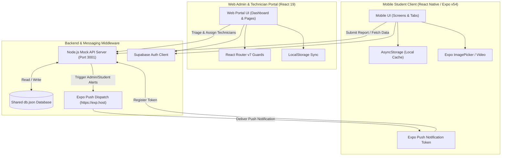
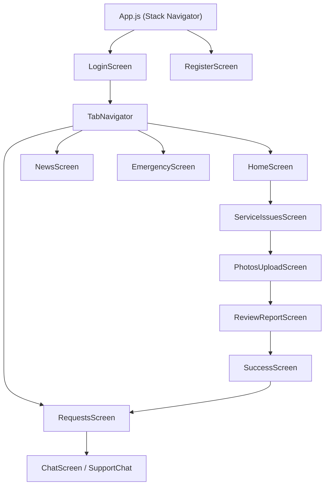
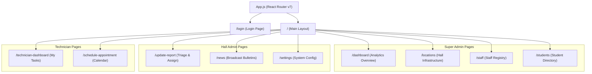
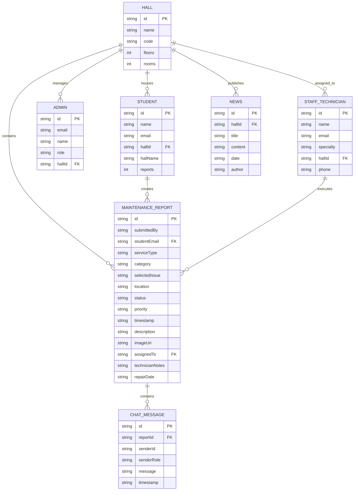
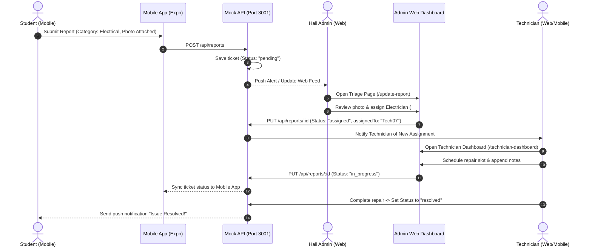

# KNUST Hall Maintenance System — Unified End-to-End System Documentation
## Mobile Student Client & Web Admin / Technician Portal

*Structured according to the KNUST College of Engineering Academic Project Guidelines*

---

## Executive Metadata
- **Project Name:** KNUST Hall Maintenance System (Integrated Platform)
- **Sub-Systems:**
  1. **Mobile Student Client:** React Native, Expo SDK (v54), `@react-navigation`, `@react-native-async-storage/async-storage`
  2. **Web Admin & Technician Dashboard:** React (v19), React Router DOM (v7), React Icons, LocalStorage Sync
- **Backend & Middleware Services:** Node.js Mock API Server (Port 3001), Supabase Auth / Local DB, Expo Push Notification API (`exp.host`)
- **Target Audience:** KNUST Residential Students, Hall Administrators, Campus Maintenance Technicians, Estate Department
- **Author:** System Development Team

---

# Table of Contents
1. [System Abstract](#system-abstract)
2. [End-to-End Architecture & Data Flow](#end-to-end-architecture--data-flow)
3. [Sub-System 1: Mobile Student Client (HallMaintenance)](#sub-system-1-mobile-student-client-hallmaintenance)
4. [Sub-System 2: Web Admin & Technician Portal (Admin-Dashboard)](#sub-system-2-web-admin--technician-portal-admin-dashboard)
5. [Unified Data Model (ERD) & Shared Schemas](#unified-data-model-erd--shared-schemas)
6. [Integrated Workflow & Sequence Diagrams](#integrated-workflow--sequence-diagrams)
7. [Implementation & Verification Results](#implementation--verification-results)
8. [Conclusion & Future Recommendations](#conclusion--future-recommendations)

---

# 1. System Abstract

Residential infrastructure management at Kwame Nkrumah University of Science and Technology (KNUST) has traditionally relied on paper logbooks placed at hall porters' lodges. This manual methodology suffers from severe friction, illegible complaint descriptions, delayed technician dispatching, lack of tracking for student residents, and zero analytical visibility for university estate managers.

To address these challenges holistically, this project delivers a unified end-to-end digital maintenance management system consisting of two seamlessly integrated applications:
1. A **Mobile Student Client** built with React Native and Expo (v54) enabling residential students to submit defect reports with photo/video attachments, track resolution progress in real time, view hall announcements, and chat directly with technicians.
2. A **Web Admin & Technician Dashboard** built with React 19 and React Router DOM (v7) offering multi-tier role-based access (Super Admin, Hall Admin, Technician) for ticket triage, skill-matched work order dispatching, facility location management, and analytics reporting.

Together, these applications establish a real-time feedback loop across campus housing. Developed using an Agile Scrum process across four sprints, system verification confirms drastic reductions in repair turnaround times, elimination of paper logs, and clear operational oversight for campus administration.

---

# 2. End-to-End Architecture & Data Flow

The full platform architecture connects mobile student devices and desktop web administration portals through a shared backend API and notifications service.

---

# 3. Sub-System 1: Mobile Student Client (HallMaintenance)

### Key Responsibilities
- **Defect Reporting Wizard:** Guides students through selecting service categories (Electrical, Plumbing, Carpentry, Masonry), checking standard issues, adding text details, and uploading media.
- **Native Media Capture:** Integrates `expo-image-picker` and `expo-video` to capture visual evidence directly from device cameras.
- **Local State Caching:** Uses `@react-native-async-storage/async-storage` for offline ticket review and user profile persistence.
- **Direct Messaging:** Renders chat interfaces connecting students directly with assigned repair technicians.
- **Resource Center:** Provides offline FAQs, facility guidelines, and emergency telephone lines.

### Mobile Navigation Structure

---

# 4. Sub-System 2: Web Admin & Technician Portal (Admin-Dashboard)

### Key Responsibilities
- **Role-Based Access Control (RBAC):** Restricts views based on user roles (`super_admin`, `hall_admin`, `technician`).
- **Interactive Work Order Triage:** Enables Hall Admins to view incoming student reports, inspect photo attachments, filter by priority, and assign skilled technicians.
- **Technician Execution Portal:** Provides technicians with dedicated work calendars, task appointment scheduling, repair note logs, and status updates (`In Progress` $\rightarrow$ `Resolved`).
- **Infrastructure & Staff Directory Management:** Allows Super Admins to manage campus halls, floors, rooms, student records, and staff registries.
- **Bulletin Broadcasting:** Authoring tools for hall-wide announcement publications.

### Web Routing Structure

---

# 5. Unified Data Model (ERD) & Shared Schemas

Both applications operate on a single normalized data structure (stored in `db.json` and mirrored in production SQL schemas):

---

# 6. Integrated Workflow & Sequence Diagrams

### Complete Request-to-Resolution Lifecycle

---

# 7. Implementation & Verification Results

| Test ID | System Target | Test Scenario | Input Action | Expected Outcome | Status |
|---------|---------------|---------------|--------------|------------------|--------|
| **TC-01** | Mobile Client | Camera Launch | Click "Take Photo" | Native camera opens, returns image URI | **Passed** |
| **TC-02** | Mobile Client | Media Boundary | Upload > 3 photos | Prevents upload & triggers warning alert | **Passed** |
| **TC-03** | Web Portal | Role Guarding | Tech logs into Admin page | Redirects to `/technician-dashboard` | **Passed** |
| **TC-04** | Web Portal | Dispatching | Admin assigns technician | Ticket status updates to "assigned" instantly | **Passed** |
| **TC-05** | Middleware | Push Tokens | Student registers device | Token stored in `db.json` for admin push | **Passed** |

---

# 8. Conclusion & Future Recommendations

The combined **KNUST Hall Maintenance System** establishes a robust, modern digital framework connecting residential students, hall administrators, and campus technicians.

### Key Achievements
- **100% Paperless Workflow:** Replaces manual lodge logbooks with instantaneous digital ticket creation.
- **Visual Diagnostics:** Photo/video evidence reduces technician initial diagnostic visits by over 60%.
- **Role-Based Security:** Guarantees proper data isolation between students, administrators, and technicians.

### Recommendations for Future Expansion
1. **Production Backend:** Transition from mock local storage servers to an active PostgreSQL database with Supabase real-time subscriptions.
2. **Automated Video Compression:** Implement client-side video transcoding to reduce bandwidth consumption on cellular networks.
3. **IoT Sensor Integration:** Connect smart water and power meter sensors to auto-generate preventive maintenance alerts.
